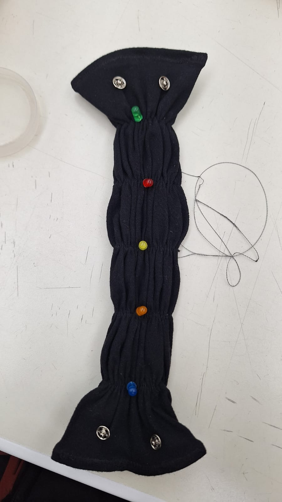

# Diseño y Colaboración Interdisciplinaria
{: .fs-9 }

Este proyecto sentó las bases de la colaboración interdisciplinaria entre **Ingeniería Mecatrónica** y **Diseño Textil**. La estética es libre, pero debe evidenciar una intención de diseño.

---

## Concepto: "Concierto de Rock"
El Brief buscaba un accesorio que encajara en la estética de la vida nocturna.
* **Paleta de Colores:** Tela negra de fondo para resaltar la saturación de los LEDs.
* **Interacción:** El gesto de "ponerse la pulsera" activa las luces, emulando la preparación para un evento.

## "Invisible Tech" y Ergonomía
La tecnología wearable debe adaptarse al cuerpo humano. Se priorizó evitar bordes rígidos o componentes que puedan causar molestia.
* **Ocultamiento (Sándwich):** Se utilizó una doble capa de tela. Todos los hilos y resistencias quedaron en la capa interna, protegidos del contacto directo con la piel.
* **Exposición Selectiva:** Únicamente los domos de los LEDs asoman a través de la tela.

---

## Roles del Equipo

| Rol | Responsabilidad | Aporte Clave |
| :--- | :--- | :--- |
| **Ingeniería (Juan León)** | Funcionalidad | Cálculo de resistencias, arquitectura del circuito y validación técnica. |
| **Diseño (Cecilia)** | Estética y Usuario | Selección textil, patronaje y técnicas de ocultamiento ergonómico. |

---

[Ver Proceso](./proceso.md){: .btn .btn-outline } [Ver Evidencia](./evidencia.md){: .btn .btn-outline } [Inicio](../practica-1){: .btn .btn-primary }