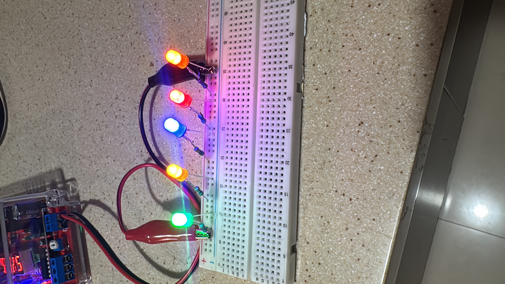
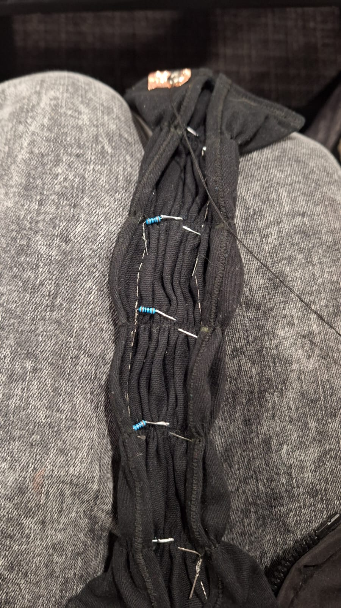
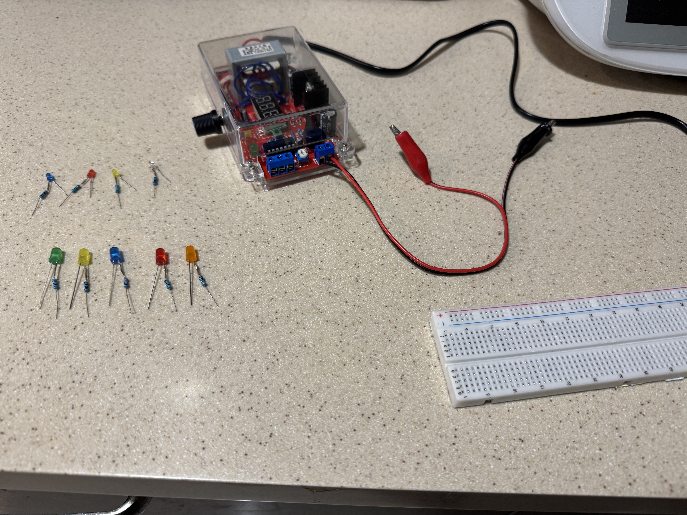

# Hardware y Topología del Circuito
{: .fs-9 }

El desafío técnico de esta práctica no radica en la complejidad lógica, sino en la **integridad eléctrica** de las conexiones flexibles. Se implementó un circuito en paralelo para garantizar que todos los LEDs reciban el mismo voltaje de la fuente, independientemente de su consumo individual. Además, es uso obligatorio de hilo conductor para las conexiones.

---

## Pruebas y Diagrama Esquemático

Antes de pasar al textil, se validó la lógica del circuito en paralelo utilizando una placa de pruebas convencional. El sistema funciona como un circuito cerrado por contacto mecánico:

1.  **Entrada:** Fuente de voltaje externa conectada a dos tiras de cobre (VCC y GND) en el extremo de la pulsera.
2.  **Conducción:** Hilo conductor (2 cabos) transporta la corriente a lo largo de la tela.
3.  **Interruptor:** Los broches (macho/hembra) cierran el circuito al abrocharse.
4.  **Carga:** 5 LEDs de colores diferentes en configuración paralela, cada uno con su resistencia limitadora de corriente.

---

## Lista de Materiales (BOM)

| Componente | Especificación | Función |
| :--- | :--- | :--- |
| **Actuadores** | 5 LEDs (Naranja, Amarillo, Verde, Rojo, Azul) | Salida visual multicolor. |
| **Resistencias** | 5 unidades (Valores calculados) | Protección de corriente individual por LED. |
| **Conductor** | Hilo conductor | Pistas flexibles del circuito. |
| **Interfaz** | 2 Tiras de cobre | Pads de conexión para caimanes. |
| **Interruptor** | 2 Broches de presión metálicos | Cierre mecánico y eléctrico. |
| **Sustrato** | Tela negra | Base estructural y aislamiento visual. |

---

[Ver cálculos](./calculos.md){: .btn .btn-outline } [Ver Proceso](./proceso.md){: .btn .btn-outline } [Inicio](../practica-1){: .btn .btn-primary }